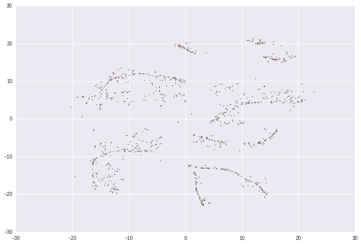
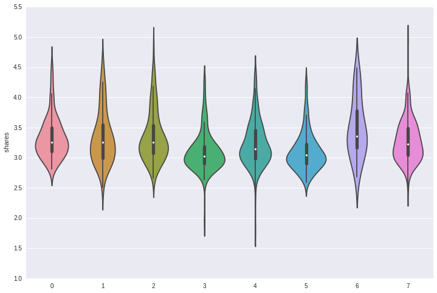
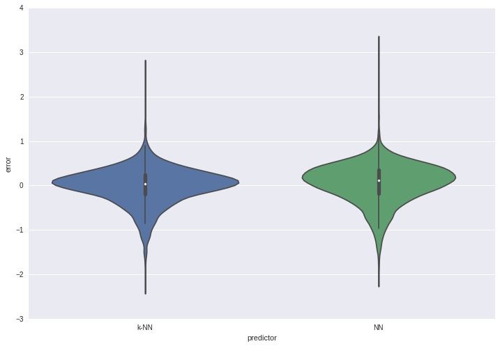

##### Faculdade de Engenharia da Universidade do Porto

# Final Report
## Neural Network for News Popularity Prediction
### Artificial Intelligence

##### Ricardo Magalhães & Neven Miculinic
##### Integrated Master of Informatics and Computer Engineering

# Index
1. [Goal](#goal)
2. [Specification](#spec)
3. [Development](#dev)
4. [Experiments](#exp)
5. [Conclusions](#con)
6. [Improvements](#imp)
7. [Resources](#res)

# 1. Goal 

The goal of this project is to implement an artificial neural network for predicting news popularity, based on number of social network shares. The dataset is from two years of Mashable articles, summarizing an heterogenous set of features. We should succesfully train a multi-layer neural network, in order to get a model capable of predicting new articles. In order to achieve that, the "Back-Propagation" algorithm should be implemented and used.

# 2. Specification 

In this project data set, we have 58 predictive attributes, where some of it are binary vectorization of categorical variables (e.g. day of the week, data channel, etc). It contains 39797 data points. 

The articles were published by Mashable (www.mashable.com) and their content as the rights to reproduce it belongs to them. Hence, this dataset does not share the original content but some statistics associated with it. The original content be publicly accessed and retrieved using the provided urls. It was acquired on January 8, 2015. 

We are going to scale all input features to [0,1] range. Also, we are going to divide our data set into three parts: training set (70%), cross validation (15%) and test set (15%).  
For base line prediction, we are going to use k-nearest-neighbour regression from sklearn Python library. Our aim is to implement a neural network, which has a better score than base line prediction. The cost function we are going to use to evaluate our news prediction score is mean squared error on data set.

# 3. Development 

In order to develop our neural network, we are using Python with Jupyter Notebook, previously known as IPython, to ease our work. There are a number of libraries used to help our development, such as TensorFlow, Sklearn, TFLearn, NumPy, Pandas and Seaborn.

We used five nearest-neighbours to interpolate the prediction. 

# 4. Experiments 

We first started to experiment with a linear regression learning algorithm, without using TensorFlow library, to see how well it would perform. However, it turned out to be a bad predictor.

Then, we analyzed the correlation between the given dataset attributes and concluded there are some correlations between variables. After that, we used t-SNE to embed data in two dimensions in order to visualize it, as you can see in the following figure. 

Figure 1 - t-SNE Data Visualization

With K-Means clustering, we divided our data into eight clusters and plotted the distribution of shares per cluster to see if there is any local strucute we could introduce in our regression. However, as you can see in the following figure, the log distribution of shares remains costant per cluster.

Figure 2 - Log share distribution per cluster

Our first approach was Mini-Batch Stochastic Gradient Descent with a batch size of 64, an algorithm used to minimize an objective function written as a sum of differentiable functions. We applied it with exponential decay learning rate and with varied network architetures (1-3 hidden layers with 10-100-1000 [relu](#res3) neurons), in order to optimize and get better results. However, to get even better optimizations, we applied [Adam Optimizer](#res1) and [Batch Normalization](#res2) techniques. Also, for further generalization, we tried L2 regularization on weights. 

# 5. Conclusions 

In conclusion, we didn't find much variation between our experiments. L2 regularization didn't seem to influence much on the model learnt. Therefore, we trained simple model with 10,5 batch normalized relu neurons with Adam Optimizer, since this is a rather simple model and offers comparable performance against k-nearest-neighbour.

Batch normalization doesn't change our model capacity, but we noticed training is somewhat quicker with it; same goes for Adam Optimizer compared to previous approaches. Furthermore, as per [paper](#res2) batch normalization has allowed us to greater learning rate and exhibits useful generalization properties.

Figure 3 - Log relative prediction error on test set

We conclude that data collected is insufficient for better prediction and that we either need more data or more features collected to perform better prediction. There is underlying stochatisc data properties that make all our predictions err in both k-NN and neural network models similarity. Furthermore, various network architeture models exhibits similar error distribution, which supports this claim. 

# 6. Improvements 

To better improve our predictions, as said in the [Conclusion](#con), we either need more data and/or features. However, the only experiment with relu activation function and other activation functions could yield better performances.

# 7. Resources 

1. "Adam: A Method for Stochastic Optimization" paper, last revised on July 2015; Diederik Kingma, Jimmy Ba; http://arxiv.org/abs/1412.6980 
2. "Batch Normalization: Accelerating Deep Network Training by Reducing Internal Covariate Shift" paper, last revised on March 2015; Sergey Ioffe, Christian Szegedy; http://arxiv.org/abs/1502.03167 
3. "Efficient Backdrop" paper, 1998; Yann LeCun, Leon Bottou, Genevieve B. Orr, Klaus-Robert Müller; http://yann.lecun.com/exdb/publis/pdf/lecun-98b.pdf 
4. "Artificial Intelligence: A Modern Approach" book, 3rd edition, December 2009; Peter Norvig, Stuart Russell
5. "Neural Networks and Deep Learning" web page, January 2016; Michael Nielsen; http://neuralnetworksanddeeplearning.com/